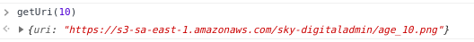
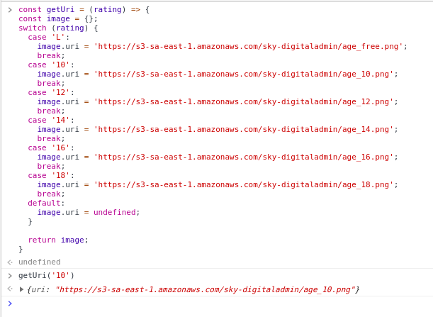

# Teste IF !

  Uma brincadeira para testar e práticar como refatorar Javascript.

## Função:

O código é uma função GetUri() que espera um parámetro para retornar um item do switch. 

## Objetivo:

O objetivo é refatorar o código seguindo as regras abaixo:

1. __Não pode utilizar if/else ou if ternário__
2. __Não pode manter o switch__
3. __Deve ter o resultado igual ao atual__

*OBS.:* O resultado atual é um objeto. Ex.:   

## Como testar:

1. Abre o navegado (preferência o Chrome)
2. CTRL + SHIFT + I (Ou botão direito/inspecionar)
3. Acessar o console
4. CTRL + l (ou botão direito/limpar console)
5. Copiar e colar o código, dá um enter
6. Digitar: getUri(value)

OBS: Entre um teste e outro, dê um Refres na página. 

## Boa sorte :D